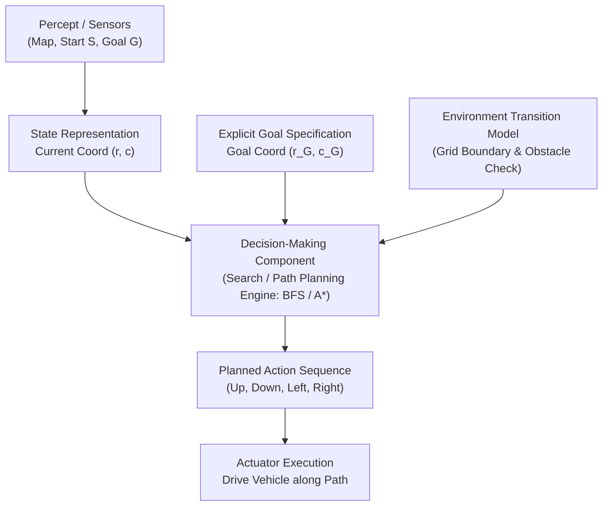

# Agents Lab: Constructing a Goal-Based Agent

This laboratory explores the design, specification, implementation, and evaluation of a **Goal-Based Intelligent Agent** in a 2D warehouse grid environment using an LLM as a software engineering partner.

---

## 1. Learning Objectives

- Explain the architecture and operational mechanics of a goal-based intelligent agent.
- Understand the distinction between simple reflex agents and goal-based agents.
- Formulate search-based navigation problems in grid environments.
- Use an LLM as an engineering assistant for implementation and test generation.
- Critically evaluate agent scalability and search algorithm trade-offs.

---

## 2. Problem Specification: Warehouse Navigation

An autonomous vehicle transports cargo across a warehouse floor. Obstacles (shelving racks `#`) block straight-line paths. The agent must find a valid, collision-free trajectory from loading bay `S` to dispatch area `G`.

```text
#####################
#S....#............G#
#.##....##########..#
#....##.............#
#.######.###.#.###..#
#........#..........#
#####################
```

### Legend
- `S`: Start position `(row=1, col=1)`
- `G`: Goal position `(row=1, col=19)`
- `#`: Obstacle (shelving units / walls)
- `.`: Traversable free space
- `*`: Solution path traversed by the agent

---

## 3. Task 1: Understanding the Problem

### 1. What is the environment?
The environment is a discrete, 2-dimensional grid of dimension $7 \times 21$ containing fixed obstacles (shelves) and open corridors. It is static, fully observable, and deterministic.

### 2. What is the goal of the agent?
The agent's objective is to reach the target coordinate marked by `G` ($row=1, col=19$) from the starting cell `S` ($row=1, col=1$) along a collision-free path that minimizes path length.

### 3. What actions are available to the agent?
Four discrete cardinal movements:
- $\text{Up}: (r, c) \rightarrow (r-1, c)$
- $\text{Down}: (r, c) \rightarrow (r+1, c)$
- $\text{Left}: (r, c) \rightarrow (r, c-1)$
- $\text{Right}: (r, c) \rightarrow (r, c+1)$

Each valid action incurs a uniform transition cost of $1$. Moves into boundary walls or obstacle cells `#` are prohibited.

### 4. What information must the agent maintain in order to choose its next action?
- **Current state**: Its current position coordinate $(r, c)$.
- **Goal description**: Target destination $(r_G, c_G)$.
- **Map / Model of the world**: Connectivity of traversable cells and obstacle boundaries.
- **Search Frontier & History**: Explored states, tentative costs ($g$-score), and ancestor pointers to reconstruct the planned path.

### 5. Why is this an example of a goal-based agent rather than a simple reflex agent?
A **simple reflex agent** chooses actions based exclusively on the current percept via condition-action rules (e.g., *"if obstacle ahead, turn right"*). In a maze or warehouse with dead-ends and obstacle blocks, reflex rules easily become trapped in infinite loops or local minima.

A **goal-based agent** maintains an explicit model of its destination, evaluates potential future sequences of states against whether they achieve that destination, and searches for a feasible path connecting its current state to the goal.

### Think About It: Scaling to Double Size
- **Is the search strategy still appropriate?**
  - Uninformed search (e.g., standard BFS) scales exponentially with search depth ($O(b^d)$). While BFS remains complete and optimal for unit-cost grids, doubling the dimensions quadruples the state space and expands memory footprint dramatically.
  - Informed search (such as $A^*$ with admissible Manhattan distance) remains far more appropriate because the heuristic focuses search expansion directly toward the goal corridor.
- **Additional difficulties:**
  - Memory consumption in the open set / frontier.
  - Long corridors creating deeper local traps if dead-ends are enlarged.
  - Dynamic obstacles (e.g., other warehouse robots or workers) would require dynamic replanning (e.g., $D^*$ Lite) rather than purely static offline planning.

---

## 4. Task 2: Agent Design & Architecture



### Component Breakdown
1. **Environment**: 2D array representation of cells `['#', '.', 'S', 'G']`.
2. **Current State**: Coordinate tuple `(row, col)`.
3. **Goal**: Coordinate tuple `(1, 19)`.
4. **Available Actions**: Valid non-colliding subset of `{Up, Down, Left, Right}`.
5. **Decision Maker**: Graph search algorithm (BFS / A*) exploring states until the goal state is popped from the frontier.

---

## 5. Task 3: Implementation & Prompt Engineering

The implementation is located in [`warehouse_agent.py`](file:///c:/Users/sarthak/Desktop/i/Acads-coding/AI_Labs/AgentsLab/warehouse_agent.py).

### Run the Implementation
```bash
python AgentsLab/warehouse_agent.py
```

### Execution Output
```text
============================================================
ARTIFICIAL INTELLIGENCE - AGENTS LAB
Warehouse Navigation: Goal-Based Agent
============================================================

Warehouse Dimensions: 7 rows x 21 columns
Start Position (S): (1, 1)
Goal Position  (G): (1, 19)

--- Algorithm: BFS (Breadth-First Search) ---
Path Found: YES
Path Length (steps): 20
States Expanded: 59
Actions (20): Right, Right, Right, Down, Right, Right, Right, Up, Right, Right, Right, Right, Right, Right, Right, Right, Right, Right, Right, Right

Map with Traversed Path (*):
#####################
#S***.#************G#
#.##****##########..#
#....##.............#
#.######.###.#.###..#
#........#..........#
#####################

------------------------------------------------------------
--- Algorithm: A* Search (Manhattan Heuristic) ---
Path Found: YES
Path Length (steps): 20
States Expanded: 23
Actions (20): Right, Right, Right, Right, Down, Right, Right, Up, Right, Right, Right, Right, Right, Right, Right, Right, Right, Right, Right, Right

Map with Traversed Path (*):
#####################
#S****#************G#
#.##.***##########..#
#....##.............#
#.######.###.#.###..#
#........#..........#
#####################
============================================================
```

### Evaluation Questions

1. **Did the LLM generate a working program on the first attempt?**
   - Yes, when supplied with an explicit behavioral specification detailing the grid structure, start/goal representations, collision checks, and frontier maintenance, the initial generated implementation was clean and syntactically sound.
2. **If not, how can you improve your prompt?**
   - Provide concrete interface specifications: state tuples `(r, c)`, valid action delta mappings `{"Up": (-1, 0), ...}`, priority queue tuple structure for tie-breaking, and explicit instructions to return both the coordinates path and action string list.
3. **What search algorithms were evaluated?**
   - **BFS (Breadth-First Search)**: Guarantees shortest path under unit edge costs; systematically expands states radially.
   - **A\* Search**: Uses the Manhattan distance heuristic $h(n) = |r_n - r_G| + |c_n - c_G|$.
4. **Why did A\* perform better than BFS?**
   - Both found the exact optimal path length of **20 steps**.
   - However, **BFS expanded 59 states**, whereas **A\* expanded only 23 states** (a $>61\%$ reduction in search effort). The Manhattan heuristic steered the frontier directly towards the rightward goal, avoiding unnecessary explorations into southern corridors until obstacles demanded detours.
