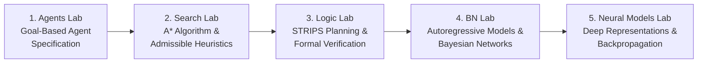

# Artificial Intelligence Laboratory Suite

This repository contains the comprehensive implementations, experimental benchmarks, empirical test suites, and detailed theoretical write-ups for the Undergraduate Artificial Intelligence Laboratory series.

The laboratories follow a unified engineering paradigm:
$$\textbf{AI Science} \longrightarrow \textbf{AI Engineering}$$
$$\text{Understand} \longrightarrow \text{Specify} \longrightarrow \text{Generate} \longrightarrow \text{Execute} \longrightarrow \text{Verify} \longrightarrow \text{Reflect}$$

---

## Repository Structure & Laboratory Index

| Laboratory Directory | Topic & Key Concepts | Primary Executable | Report / Documentation |
| :--- | :--- | :--- | :--- |
| [**AgentsLab/**](file:///c:/Users/sarthak/Desktop/i/Acads-coding/AI_Labs/AgentsLab/) | **Goal-Based Agents**<br>• Warehouse navigation grid problem<br>• Goal-based vs. simple reflex agent architectures<br>• LLM prompt engineering & agent specification | [`warehouse_agent.py`](file:///c:/Users/sarthak/Desktop/i/Acads-coding/AI_Labs/AgentsLab/warehouse_agent.py) | [`AgentsLab/README.md`](file:///c:/Users/sarthak/Desktop/i/Acads-coding/AI_Labs/AgentsLab/README.md) |
| [**SearchLab/**](file:///c:/Users/sarthak/Desktop/i/Acads-coding/AI_Labs/SearchLab/) | **Informed & Uninformed Search**<br>• Formal formulation: $P = (S, A, T, s_0, G, c)$<br>• $A^*$ search with Manhattan distance<br>• Heuristic comparisons: $h=0$, Euclidean, Manhattan, $2\times h$<br>• Edge cases: trivial, blocked, and alternative paths | [`search_agent.py`](file:///c:/Users/sarthak/Desktop/i/Acads-coding/AI_Labs/SearchLab/search_agent.py) | [`SearchLab/README.md`](file:///c:/Users/sarthak/Desktop/i/Acads-coding/AI_Labs/SearchLab/README.md) |
| [**LogicLab/**](file:///c:/Users/sarthak/Desktop/i/Acads-coding/AI_Labs/LogicLab/) | **Logical Reasoning for Planning**<br>• $\text{Logic} + \text{Search} = \text{Planning}$<br>• STRIPS action schema (preconditions & effects)<br>• Forward state-space BFS planning<br>• Independent plan verification via Prolog & Python | [`logic_planner.py`](file:///c:/Users/sarthak/Desktop/i/Acads-coding/AI_Labs/LogicLab/logic_planner.py)<br>[`planner.pl`](file:///c:/Users/sarthak/Desktop/i/Acads-coding/AI_Labs/LogicLab/planner.pl)<br>[`prolog_verifier.py`](file:///c:/Users/sarthak/Desktop/i/Acads-coding/AI_Labs/LogicLab/prolog_verifier.py) | [`LogicLab/README.md`](file:///c:/Users/sarthak/Desktop/i/Acads-coding/AI_Labs/LogicLab/README.md) |
| [**BNLab/**](file:///c:/Users/sarthak/Desktop/i/Acads-coding/AI_Labs/BNLab/) | **Bayesian Networks & Language Models**<br>• Chain rule factorization: $P(X_{1:T})$<br>• First-order & second-order Markov models<br>• Conditional Probability Tables (CPTs)<br>• Greedy vs. sampling text generation<br>• Mathematical bridge to modern Transformer LLMs | [`bn_language_model.py`](file:///c:/Users/sarthak/Desktop/i/Acads-coding/AI_Labs/BNLab/bn_language_model.py) | [`BNLab/README.md`](file:///c:/Users/sarthak/Desktop/i/Acads-coding/AI_Labs/BNLab/README.md) |
| [**NeuralModelsLab/**](file:///c:/Users/sarthak/Desktop/i/Acads-coding/AI_Labs/NeuralModelsLab/) | **Neural Models: Learning & Representation**<br>• Linear inseparability of XOR safety sensor problem<br>• 2-2-1 MLP with PyTorch<br>• Backprop gradient inspection ($\partial \mathcal{L} / \partial W^{(1)}$)<br>• Weight symmetry breaking & zero-initialization failure<br>• Activation comparison (Sigmoid, Tanh, ReLU)<br>• 3-class extension & Softmax shift invariance proof | [`neural_models.py`](file:///c:/Users/sarthak/Desktop/i/Acads-coding/AI_Labs/NeuralModelsLab/neural_models.py) | [`NeuralModelsLab/README.md`](file:///c:/Users/sarthak/Desktop/i/Acads-coding/AI_Labs/NeuralModelsLab/README.md) |

---

## Pedagogical Progression



1. **Agents Lab**: Establishes how to conceptualize an agent operating with an explicit internal goal, environment model, and action planning framework.
2. **Search Lab**: Operationalizes goal achievement via formal graph search ($A^*$ and BFS), showing how heuristics steer search frontiers efficiently through complex mazes.
3. **Logic Lab**: Bridges classical logic and search to solve multi-step operational planning problems where world state updates follow explicit preconditions and effects.
4. **Bayesian Networks Lab**: Extends deterministic state representations to probabilistic sequences, demonstrating how language generation derives directly from Bayesian network factorizations.
5. **Neural Models Lab**: Connects probabilistic outputs to parameterized neural functions, demonstrating how backpropagation learns non-linear latent representations that overcome linear limitations.

---

## Environment & Requirements

- **Operating System**: Windows / Linux / macOS
- **Python Version**: Python 3.8+ (Tested on Python 3.12 / 3.13)
- **Dependencies**:
  - `numpy`
  - `torch` (PyTorch CPU is sufficient; no GPU required)
  - *(Optional)* SWI-Prolog (`swipl`) for native Prolog execution (a standalone Python verifier is included).

---

## Quickstart: Running All Laboratory Experiments

Execute the experiments for each lab directly from the repository root:

### 1. Agents Lab
```bash
python AgentsLab/warehouse_agent.py
```
*Outputs optimal collision-free paths for BFS and $A^*$, along with grid trajectory visualizations.*

### 2. Search Lab
```bash
python SearchLab/search_agent.py
```
*Executes the complete test suite (Original Labyrinth, Trivial, Blocked, Alternative Paths) and compares BFS vs. $A^*$ across multiple heuristics ($h=0$, Euclidean, Manhattan, $2\times h$).*

### 3. Logic Lab
```bash
# Run the STRIPS forward planning suite (Solvable, Impossible, Distractor tests)
python LogicLab/logic_planner.py

# Run the independent Prolog logical verification test suite
python LogicLab/prolog_verifier.py
```

### 4. Bayesian Networks Lab
```bash
python BNLab/bn_language_model.py
```
*Calculates CPT distributions, tests probability normalization ($\sum P = 1.0$), generates 20 sentences via sampling, compares greedy vs. sampling generation, and benchmarks first- vs. second-order Markov models.*

### 5. Neural Models Lab
```bash
python NeuralModelsLab/neural_models.py
```
*Trains linear baseline and 2-2-1 XOR networks, verifies reverse-mode automatic differentiation gradients, demonstrates zero-weight symmetry failure, compares Sigmoid vs. Tanh vs. ReLU, and verifies Softmax numerical shift invariance on a 3-class sensor task.*

---

## Laboratory Highlights & Key Findings

### Agents & Search Labs
- In open warehouse environments, $A^*$ using Manhattan distance reduced search state expansions by **$>61\%$** compared to BFS (23 vs 59 states) while maintaining optimal path length (20 steps).
- In constrained single-path labyrinths with zero branching alternatives, both complete algorithms systematically explore all reachable free cells (64 states).

### Logic Lab
- Implemented STRIPS planning with positive/negative preconditions and effects.
- Tested failure detection: when `PickUp` is removed, the planner cleanly reports `No plan found` rather than hallucinating steps.
- Demonstrated formal plan verification in both Python and Prolog (`planner.pl`), confirming that **independent symbolic verification** is essential when plans are generated by statistical AI.

### Bayesian Networks Lab
- First-order greedy generation fell into an infinite absorbing loop (`the cat sat on the cat sat on the...`) because $\text{argmax}$ always selects the same path.
- Sampling generation produced diverse outputs across the distribution.
- Second-order modeling conditioned on $(X_{t-2}, X_{t-1})$ produced completely coherent, grammatical sentences by incorporating preceding relational context.

### Neural Models Lab
- Linear models cannot solve XOR, stalling at loss `0.6931` and $50\%$ accuracy due to intersecting convex hulls.
- Zero-weight initialization causes hidden neurons to compute identical forward passes and receive identical backprop gradients, permanently failing to break symmetry.
- Tanh and Sigmoid successfully achieved $>99.9\%$ classification accuracy with final loss $< 0.003$.
- Softmax output probabilities were proven shift-invariant under logit offsets ($\max |\Delta p| < 2 \times 10^{-10}$), validating the numerical stability technique used in deep learning frameworks.
